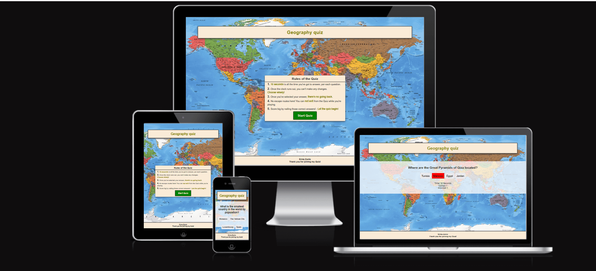
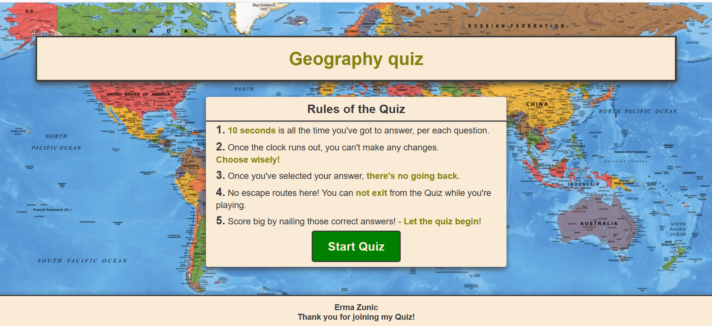
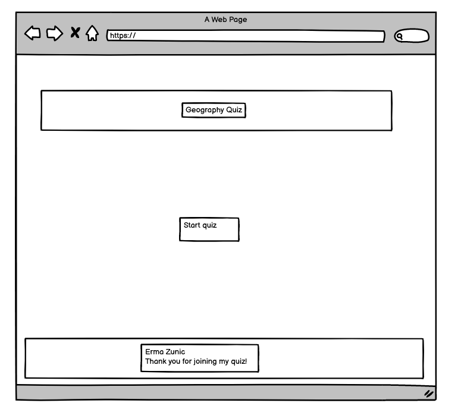
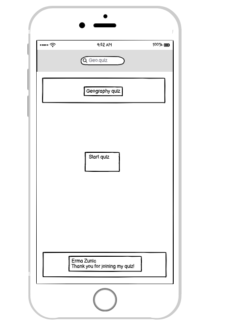
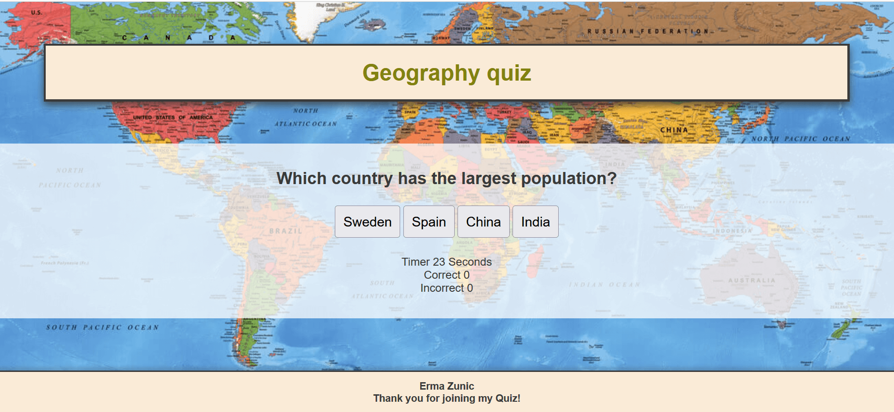
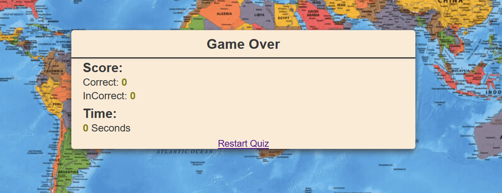
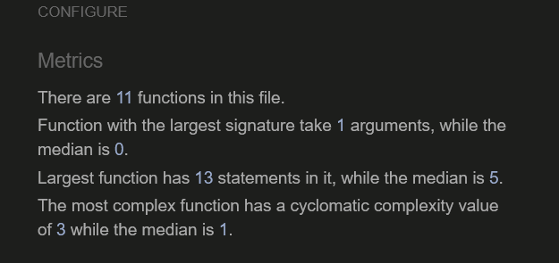
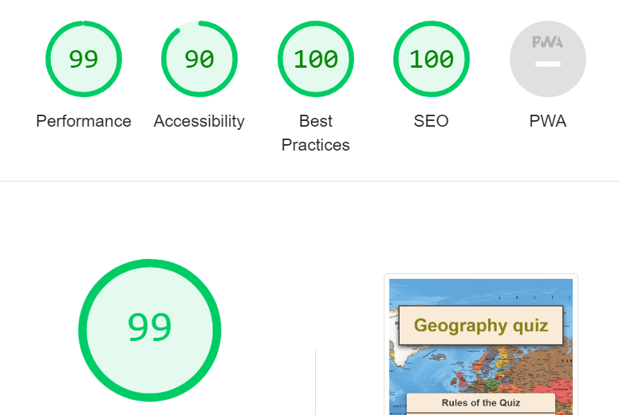

# The Geography Quiz

The Geography Quiz is a fun educational quiz for everyone. The aim of the quiz is to answer a questions about different countries. In this quiz there is 12 questions and every question has 4 answer options. Questions are about different simbols in countries, capital cities etc...
This quiz is fun to strengthen current knowledge and maybe learn something new about other country.

The live link can be found here - [Geography Quiz](https://8000-ermaa8-geoquiz-18a7owhkze8.ws-eu110.gitpod.io/index.html)

Table of content
 * [Site Owner Goals](#site-owner-goals)
 * [User Stories](#user-stories)
    + [First Time User](#first-time-user)
    + [Returning user](#returning-user)
    + [Frequent user](#frequent-user)
 * [Design](#design)
    + [Fonts](#fonts)
    + [Layout](#layout)
    + [Wireframes](#wireframes)
 * [Features](#features)
    + [Home Page](#home-page)
    + [Rules Page](#rules-page)
    + [Quiz selection](#quiz-selection)
 * [Testing](#testing)
    + [Validator Testing](#validator-testing)
      - [HTML](#html)
      - [CSS](#css)
      - [Javascript](#javascript)
      - [Accessibility](#accessibility)
    + [Button Testing](#button-testing)
    + [Game Testing](#game-testing)
    + [Browser Testing](#browser-testing)
    + [Fixed Bugs](#fixed-bugs)
 * [Technologies Used](#technologies-used)
    + [Languages](#languages)
    + [Frameworks - Libraries - Programs Used](#frameworks---libraries---programs-used)
 * [Deployments](#deployments)
 * [Acknowledgments](#acknowledgments)
 

 ## Site owner goals
 - To provide the user an easy to navigate the quiz that is fun and educational.
 - Ivoke a sence of urgency to complete the game as quick as possible.
 - To get the user answer as many rights as possible.
 - To present the user with a website that is visually appealing.

 ## User Stories
 
 - ### First Time User
 - As a firt time user I want to understand purpose of this quiz.
 - As a first time user I want to have fun with this quiz and learn something new.

 - ### Returning user
 - As a returning user i want to be able to play same quiz without getting same questions in same order.
 - As a returning user I want to save my correct answers.

 - ### Frequent user
 - As a frequent user I want to beat my score.

 ## Design
 - The quiz backround picture represents a world and it is suitable picture because it is a geography quiz. There is four answers alternatives and all of them are in a box that turs a green colour when a user want to click on the answer alternative. 

 

 ### Fonts
 - Sedan is the font that is used throught the whole website. The font is imported via [Google Fonts](https://fonts.google.com/). Sans Serif is font that is used as a backup font in case that the main font is not imported into the site correctly.

 ### Layout
 Geography quiz have a 5 sections:
 - Title area
 - Start button
 - Rules for the game
 - Play area
 - Game over area

 ### Wireframes

 - Wireframes were produced using Balsamiq.
 

 
Desktop wireframe

 
 
  

 

 
Mobile wireframe

 
 
  

 ## Features

### Home Page
- The landing page of the game have very simple layout that makes easy to users to start a quixz and read a rules.
- When rules are read there is option to continue or to exit a quiz.

### Rules Page
- The rules part of the quiz contains a 5 rules that are necessary to follow for the best experience. A user can not start a quiz before reading a rules.

### Quiz Selection
- Quiz selection contains of 12 questions in total. A user will have 10 seconds to answer each question. 
- If user answe right to the question, the correct score will be higher and if user answers fail the incorrect score will be higher. When quiz is over, score area appears and shows how many correct and how many incorrect answers user had.

### Game Over Area
- Game over area contains of incorrect and correct results as well as a time score and restart button.

## Testing

### Validator Testing
- #### HTML
 - [W3C Validator Results](https://validator.w3.org/nu/#textarea)
- #### CSS
 - [W3C CSS Validator](https://jigsaw.w3.org/css-validator/validator)
- #### Javascript
No errors were found.

### Accessibility 

### Button Testing
- All buttons were tested manually to make sure that user is directed to the right section of the quiz.

### Quiz Testing
 - The quiz was tested by friends to make sure that everything worked as intended including a few things:
 - The rules area appears first.
 - That queston area appears after and timer start when first question is up.
 - The score area appears after quiz is over.

### Browser Testing
- The website was tested on different browsers like Google Chrome, Firefox and Microsoft Edge with no issues noted.

### Fixed Bugs
- @keyframe in the style css showed error in the validator and with mentors help I got information that this part is not necessary and it was easy fixed with removing this part from the style css.

- function checkAnswer(event) in the script.js used a colours when answer is pressed just to show which one is right and which one is right. The parantess was necessary to use for the colours and not sign equal to ('green).

## Technologies Used
### Languages
- HTML
- CSS
- JavaScript

### Frameworks - Libraries - Programs Used

- [Balsamiq](https://balsamiq.com/) 
- [GitHub](https://github.com/) 
- [Google Fonts](https://fonts.google.com/)
- [Favicon Converter](https://favicon.io/favicon-converter/) 
- [Cosmopolitan magasine](https://www.cosmopolitan.com/)
- [Am I Responsive](http://ami.responsivedesign.is/)
- [W3C](https://www.w3.org/) 
- [Javascript](https://jshint.com/)
- [W3C CSS](https://jigsaw.w3.org/css-validator/)
- [TinyPNG](https://tinypng.com/) 

## Deployment

The site was deployed using GitHub pages. The steps to deploy using GitHub pages are:
1. Go to repository on Github.com.
2. Select 'settings' near the top of the page.
3. Select 'Pages' from the menu bar on the left on the page.
4. Select 'Branch' dropdown menu and select the main branch.
5. Once selected, click 'Save'.
6. Deployment should be confirmed by a message on a right sid on GitHub. 

## Acknowledgments
My mentor Antonio for his help and support and
Slack community for tips and tricks.
